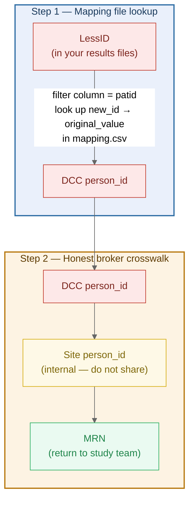

# COMPARE Y1Q1 Query Results: Patient ID Crosswalk Guide

**For:** ETL analysts / honest brokers at each participating site  
**Query:** `compare_deq_q01`  

## Why Don't I See Real Patient IDs in My Results Files?

The `.cpt` (SAS transport) and `.xlsx` files you received have been **de-identified**: every
patient, encounter, provider, and facility identifier has been replaced with a
study-specific surrogate identifier, called a **LessID**.

LessIDs look like this:

| Type | Example |
|---|---|
| Patient | `PAT_C7CHCO_00000001` |
| Encounter | `ENC_C7CHCO_00000001` |
| Provider | `PRV_C7CHCO_00000001` |
| Facility | `FAC_C7CHCO_00000001` |

The site code in the middle (e.g. `C7CHCO`) is your site's PCORnet Data Mart ID, so LessIDs never collide across sites.

To associate these back to your local patient records, you need to perform a **crosswalk** using the mapping file described below.

## What is the Mapping File?

Along with your results, you received a file named:

```
[DataMartID]_compare_q01_mapping.csv
```

This is a CSV with three columns:

| Column           | Description                                                             |
| ---------------- | ----------------------------------------------------------------------- |
| `column`         | The CDM field the ID came from (e.g. `patid`, `encounterid`)            |
| `original_value` | The **DCC `person_id`** (or encounter/provider ID) from the PEDSnet CDM |
| `new_id`         | The **LessID** that appears in your results files                       |

Example rows (values redacted):

```
column,original_value,new_id
patid,<DCC_person_id>,PAT_C7CHCO_00000001
patid,<DCC_person_id>,PAT_C7CHCO_00000002
encounterid,<DCC_encounter_id>,ENC_C7CHCO_00000001
```

> [!WARNING]  
> The mapping file contains **PEDSnet DCC `person_ids`**, which are Protected Health Information (PHI). It is intended **for ETL analysts only**. Do not share the mapping file — or any file derived from it — with study staff, CRCs, or site PIs.

The `new_id` column contains the LessID — the de-identified surrogate that appears in the results files. It is useful as a reference while performing the crosswalk (e.g. to verify you matched the right row), but **CRCs and site study staff do not need it**. Once you have completed the crosswalk and produced your MRN list, we recommend removing the `new_id` column before sharing the output with your clinical research coordinators or site PI.

## Step 1 — Find the DCC `person_id` for a given LessID

> [!NOTE]  
> This document is addressed to you as the site's **honest broker / ETL analyst**. The mapping file contains PHI and must not be shared with or opened by anyone else at your site.

### In Excel / Any Spreadsheet Tool

1. Open `[DataMartID]_compare_q01_mapping.csv`.
2. Filter the `column` column to `patid`.
3. Find the row where `new_id` matches your LessID (e.g. `PAT_C7CHCO_00000001`).
4. The corresponding `original_value` is the **DCC person_id**.

### On the Command line (Linux/Mac)

Replace `PAT_C7CHCO_00000001` with the LessID you are looking up:

```bash
grep "PAT_C7CHCO_00000001" C7CHCO_compare_q01_mapping.csv
```

Output will look like:

```
patid,<DCC_person_id>,PAT_C7CHCO_00000001
```

The middle field is the DCC `person_id`.

To extract all patient ID rows at once:

```bash
grep "^patid," C7CHCO_compare_q01_mapping.csv
```

## Step 2 — Crosswalk DCC `person_id` to Your Local MRN

The DCC `person_id` is a PEDSnet-internal identifier. As the honest broker, you hold the mapping between DCC `person_ids` and local MRNs.

| Role                                                                     | LessID | DCC `person_id` | Site `person_id` | MRN | Study ID (`participantid`) |
| ------------------------------------------------------------------------ | :----: | :-------------: | :--------------: | :-: | :------------------------: |
| **PEDSnet DCC** Data Scientist                                           |   ✅    |        ✅        |        ❌         |  ❌  |             ✅              |
| **PEDSnet DCC** Data Manager                                             |   ✅    |        ✅        |        ❌         |  ❌  |             ✅              |
| **PEDSnet Site** Honest Broker/ETL Analyst                               |   ✅    |        ✅        |        ✅         |  ✅  |             ✅              |
| **PEDSnet Site** Study Staff (e.g. chart reviewer, research coordinator) |   ✅    |        ❌        |        ❌         |  ✅  |             ✅              |

This step follows the standard PEDSnet re-identification process. For full details, see:

> **[PEDSnet Data Integration, Re-Identification and Crosswalking](https://pedsnet.atlassian.net/wiki/spaces/PFMP/pages/47611974/Data+Integration+Re-Identification+and+Crosswalking)**  

In brief:
1. As the honest broker, use the DCC `person_ids` from the mapping file (Step 1) to look up your site's local **Site `person_id`**, and from there the **MRN**.
2. Return only the **MRN** to the study team — the DCC `person_id` and Site `person_id` must not leave the honest broker.

## Summary



---

## Which files are affected?

- **`.cpt` / SAS datasets** — all `patid`, `encounterid`, `providerid`, `facilityid` columns contain LessIDs.
- **`.xlsx` reports** (`RECRUITMENT_OPPORTUNITY`, `EMERGENCY_VISITS`, `HOSPITALIZATIONS`, etc.) — the `patid` column contains LessIDs.

> [!note]
> Most of these reports are only populated for **enrolled trial participants**; it is expected that they are empty for sites with no enrolled patients.

The `datamartid` field is **not** de-identified and appears as-is (e.g. `C7CHCO`).

The `trialid` field **has been de-identified** and will appear as a LessID (e.g. `ID_C7CHCO_XXXXXXXX`). It can be crosswalked back to `PT_COMPARE` using the mapping file — filter the `column` column to `trialid`.

The `participantid` field contains the EDC trial enrollment number (e.g. `1782-1`) and is **not** de-identified.
