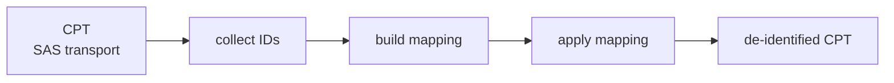

# LessID_v2

A Python + SAS pipeline for de-identifying CDM (Common Data Model) datasets for the COMPARE study. Raw patient, encounter, provider, and facility IDs are replaced with deterministic, site-scoped surrogate IDs.

---

## Overview



Each site gets its own `mapping.csv` so surrogate IDs are stable across re-runs and never collide across sites.

---

## Prerequisites

| Requirement | Notes |
|---|---|
| **SAS 9.4** | Must be installed and licensed on the host machine. The pipeline calls `sas` via subprocess. |
| **Python 3.9+** | A venv is created automatically on first run. `tomllib` is stdlib in 3.11+; the `tomli` backport is used automatically on 3.9/3.10. |

---

## Setup

Copy and configure:

```bash
cp config/lessid.example.toml config/lessid.toml
# edit config/lessid.toml — set cpt_base, out_base, lookup_base, work_base to real host paths
```

`config/lessid.toml` is **gitignored** — it contains absolute paths and must never be committed.

```toml
[paths]
cpt_base    = "/data/sas_queries/<study_owner>/<study>"
out_base    = "/data/sas_queries/<your_user>/lessid_drnoc"
lookup_base = "/data/sas_queries/<your_user>/lessid_lookup"
work_base   = "/data/sas_queries/<your_user>/lessid_work"
sas_bin     = "sas"   # resolved via PATH; or set to an absolute path

[processing]
date_shift_days = 0   # set >0 to enable per-patient date perturbation
sites           = []  # leave empty to auto-discover all sites
# parallel omitted → auto: max(2, cpu_count-8); on pedsdb08 (32 CPUs) = 24
```

Copy the run wrapper (gitignored):

```bash
cp run_lessid.example.sh run_lessid.sh
```

On first run, the wrapper auto-creates `.venv/` and installs `requirements.txt`. **Ensure you have already created the venv with `python3.11` as shown above before the first run.**

## Run

```bash
./run_lessid.sh plan          # dry run — no execution
./run_lessid.sh run --yes     # full pipeline
```

### Subcommands

| Command | Description |
|---|---|
| `lessid plan [SITE]` | Preview which columns will be remapped — no execution |
| `lessid run [--site S] [--yes] [--parallel N] [--force]` | Full pipeline: CPT → mapping → verify |
| `lessid verify [--site S]` | Re-run verification checks only |
| `lessid spotcheck SITE` | Interactive REPL: look up mappings, sample pairs |
| `lessid audit [SITE...] [-o FILE]` | List all ID columns that will be remapped; optionally export to CSV |

The pipeline prints the resolved worker count and a summary table at each phase:

```
lessid pipeline
==================================================
  Sites:    12
  Force:    False
  Parallel: 24 worker(s)  (cpu_count=32)
  ...
```

---

## Configuration reference

### `[columns]`

| Setting | Effect |
|---|---|
| `remap_never` | Always skip these columns even though they end in `id` |
| `remap_exclude` | Per-run additional exclusions |
| `remap_extra` | Columns that don't end in `id` but should still be remapped |
| `[columns.aliases]` | Multiple column names that share the same mapping key (e.g. all `*_providerid` variants) |

### `[processing]`

| Setting | Default | Notes |
|---|---|---|
| `parallel` | `max(2, cpu_count-8)` | Omit to use the auto-default; override with an integer or `"max"` |
| `date_shift_days` | `0` | Set to a positive integer to enable per-patient date perturbation |
| `sites` | `[]` | Leave empty to auto-discover all sites under `cpt_base` |
| `force` | `false` | Reprocess sites that already have a `.cpt_completed` marker |

---

## ID prefix assignment

| Prefix | Columns |
|---|---|
| `PAT` | `patid`, `person_id`, `org_patid` |
| `ENC` | `encounterid`, `visit_id` |
| `PRV` | `providerid`, `*_providerid` |
| `FAC` | `facilityid`, `lab_facilityid`, `trial_siteid`, `site` |
| `ID` | everything else |

Surrogate ID format: `{PREFIX}_{SITECODE}_{8DIGITS}` — e.g. `PAT_C7LC_00000118`.

---

## Output structure

```
lessid_drnoc/
└── C7LC_compare_deq_q01/
    ├── 20240601_compare_deq_q01.cpt   ← de-identified CPT (SAS transport)
    └── .cpt_completed                 ← marker: CPT phase done (persists after verify)

lessid_lookup/                         ← KEEP RESTRICTED (contains raw IDs)
└── C7LC/
    ├── C7LC_mapping.csv               ← (column, original_value, new_id)
    ├── C7LC_mapping_report.txt
    └── site_meta.csv                  ← DATAMARTID read from HARVEST
```

